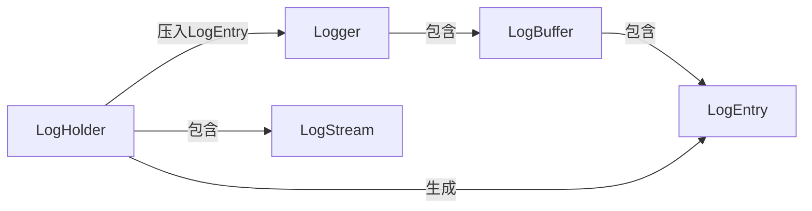

# PLog

### 简介

***plog***（pithy log）是一个**简洁快速小型玩具**C++异步日志库，**设计目标**(自吹自卖，手动狗头)：

- **简洁**：使用时只需要包含一个文件，配置简单只需两三行代码；c++17，与平台无关,可以使用C式输入，也可以使用C++ 流式输入，重载了<<运算的都可以输入
- **功能全**：滚动生成log目录和文件，可以设置每个文件的最大大小，超出大小后，自动生成新的文件，自动加后缀，追加后缀格式-> .1 .2
- **快速**：每秒百万级速度，借鉴其他库，把格式化放到写入本地时再调用，前台快速返回，减少对工作线程的影响
- **内存安全**：代码中的指针均使用智能指针托管，文件操作，缓冲读取等不使用裸指针，大大增加内容安全性
- **线程安全**：使用**异步**方式，使用锁来保证安全(频繁加减锁会导致性能下降)
- **数据安全**：采用stl的list<>作为缓冲结构，写日志和日志到文件不在同一数据区,保护之前写入的内容，当前缓冲区不足后自动拓展，同时通知后台线程把缓冲区的数据写入本地文件，为防止前台程序日志写入间隔过大导致之前数据丢失，每隔10ms(可调)不管缓冲区是否写满，都强制写入本地。

#### 测试情况

- 两台机器，配置如下
  - i7-9700@4.3GHz×8核8线程，512固态(M.2接口，品牌不知道，这台电脑是戴尔台式机成就5880，应该不是杂牌固态)，rtx2060,16G内存，win10 1909版本
  - i5-2500@3.3GHz×4核4线程，512固态(SATA3接口，惠普)，rx470d,8G内存,win10 20h2版本
  - i5-9400F@2.9GHz×6核6线程，240固态,16G内存，ubuntu24.04.1
- 测试情况(每条220字节左右的log 以及，开100个线程下)
  - ~~1号机器平均每秒70W条，吞吐量140MB/s~~ (代码变动，已经无参考意义)
  - ~~2号机器平均每秒90W条，吞吐量180MB/s~~
  - 3号机器前台调用平均120W条,260MB/s，,后台持久化77W条,170MB/s
- 2021.1.26增加 第一台机器我在系统换成manjaro，其他配置不变的情况下，速度110w条/s,折合吞吐量220MB/s，回头再测试下我的老电脑manjaro下的速度

~~我的老电脑反而速度更快，猜测可能是惠普的固态比戴尔台式机的固态写入速度更快，不知道有没有达到最大写速度，以后再研究研究。~~

> 注：代码变动，还未从新测量

### TODO

- [ ] 性能优化
- [ ] 内容占用测试，CPU占用测试
- [X] 程序退出处理（正常退出保证日志能够写入本地）
- [X] 异常退出处理（发生崩溃程序异常退出前保证日志能够写入本地）
- [X] 日志分级过滤（目前日志级别仅仅是打印的文本，并没有真正的分级输出）
- [X] 更多其他功能，如控制台打印开关，彩色打印，条件打印等

## 快速使用

```bash
cmake -B build
cmake --build build
./build/log_demo
```

日志格式固定

> 简单格式  level yyyyMMdd hh.mm.ss.SSSSSSZ threadID file:line] message
>
> 详细格式  level yyyyMMdd hh.mm.ss.SSSSSSZ threadID file:line func(args...))] message
>
> 例如：
>
> INFO  20250115 15:44:43.849524Z 10e48a5907227b10 main.cc:181]wheel_3real output: 0 0.110657

使用

```c++
#include "plog.hpp"

int main(int argc, char** argv) {
  logger::initlogging(argv[0]);
  logger::colorlogtostderr(true);
  logger::logoutsink(LogSink::CONSOLE);
  // // logger::maxlogsize(1024 * 16);
  LOG(INFO) << "INFO" << "12" << std::endl;
  LOG(DEBUG) << "DEBUG" << std::endl;
  LOG(WARN) << "WARN";
  LOG_WARN("%s", "WARN");
  //   LOG_FATAL("%s%d", "12", 21);
  LOG(ERROR) << "hello world" << std::endl;
  LOG_IF(INFO, 1) << "hello world";
  for (int i = 0; i < 10; i++) {
    LOG_EVERY_N(INFO, 2) << "hello world every 2";
    LOG_ONCE(INFO) << "hello world once2";
  }
  std::thread t([]() {
    for (int i = 0; i < 10; i++) {
      LOG_EVERY_N(INFO, 2) << "hello world every 2";
      LOG_ONCE(INFO) << "hello world once2";
    }
  });
  t.join();
  logger::shudownlogging();
  return 0;
}
```

```c++

```

## 设计思路

#### 数据结构

 主要包含五个类

- **LogHolder**类：用于前台生成日志，析构时生成LogEntry并加入到buffe里
- LogEntry：日志条目，包含了需要输出的内容，此时未格式化，这样前端写入可以更快，减少对业务线程负担
- LogStream：日志内容的容器，使用了std::ostringstream
- **LogBuffer**类：日志基础容器类，包装了一个 `std::deque<LogEntry>`，提供状态、可用空间、加入日志、返回数据等操作
- **Logger**类：包含日志初始化，读写线程操作等,使用 ``std::List<std::shared_ptr<LogBuffer>>``作为日志维护队列

类间关系



#### 运行过程

 基本的运行过程为简单的生产者消费者模式，前端线程生产log数据放入日志维护队列，后端线程负责把队列中的数据写入本地

- 情形1

  curr_in_buffer为队列头部buffer,前端的log都写入此buffer,后端curr_out_buffer指向队列最后一个buffer

  
- 情形2

  每当curr_in_buffer写满一个buffer，会使用条件变量通知后台线程开始把队列中已满的buffer写入本地，同时会在队列顶端添加一个新的buffer作为当前写入buffer,后台线程每把一个buffer写入本地后，丢弃此buffer，并把curr_out_buffer指向新队列的最后一个buffer
  
- 情形3

  一旦后台线程被唤醒，会依次把每个buffer写入本地，直到curr_in_buffer和curr_out_buffer指向同一个buffer，此时队列中只剩余一个buffer,此时后台线程修眠
  
- 情形4

  当运行到情形3后，后台修眠，等待条件变量通知，但是为防止因前端写入很少，导致一个buffer很长时间没有写满，此时如果程序退出，则buffer中的log内容可能无法写入本地，故设置每隔2s唤醒一次后台线程，唤醒后不管当前buffer有没有写满，都把当前buffer设置为写满状态，并添加一个新buffer，后台把刚刚的buffer写入本地，写入后情形可能会进去情形3，也可能进去情形5
  
- 情形5

  当前端写入过快，后台来不及写入，则在队列顶端加入新的buffer，依次类推，则又进入了开始状态情形1，如此周而复始
  

## 其他问题

欢迎大家评论和指正，不尽感激

[代码github地址](https://github.com/luqiankun/plog)
[代码gitee地址](https://gitee.com/lqk1949/plog)
