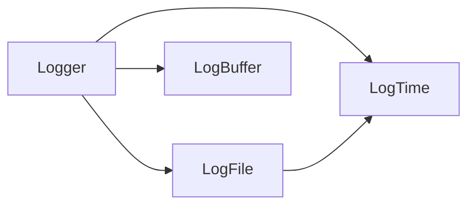

# PLog

### 简介

***plog***（pithy log）是一个**简洁快速，小而美**的C++异步日志库，**设计目标**(自吹自卖，手动狗头)：

- **简洁快速**：每秒百万级速度，使用时只需要包含一个文件，配置简单只需两三行代码；总代码量加空行和注释350行左右，真正的核心代码170行左右，不依赖其他代码只依赖C++17（主要用了c++17的filesystem,其基本只需要C++11，你可以自己替换这一部分），与平台无关
- **功能全**：滚动生成log目录和文件，可以设置每个文件的最大大小，超出大小后，自动生成新的文件，自动加后缀，追加后缀格式->（1）（2），每个小时一个文件
- **易拓展**：容器大小，时间格式，log格式，目录名称格式，缓冲写入间隔都可以自定义
- **内存安全**：代码中的指针均使用智能指针托管，文件操作，缓冲读取等不使用裸指针，大大增加内容安全性
- **线程安全**：使用**异步**方式，读写日志不在同一线程，不阻塞主线程，线程间使用条件变量来通知，使用unique_lock，防止忘记解锁
- **数据安全**：采用stl的list<>作为缓冲结构，写日志和日志到文件不在同一数据区,保护之前写入的内容，当前缓冲区不足后自动拓展，同时通知后台线程把缓冲区的数据写入本地文件，为防止前台程序日志写入间隔过大导致之前数据丢失，每隔2s(可调)不管缓冲区是否写满，都强制写入本地。
#### 测试情况
- 两台机器，配置如下
  - i7-9700@4.3GHz×8核8线程，512固态(品牌不知道，这台电脑是戴尔台式机成就5880，应该不是杂牌固态)，rtx2060,16G内存，win10 1909版本
  - i5-2500@3.3GHz×4核4线程，512固态(惠普)，rx470d,8G内存,win10 20h2版本
- 测试情况(每条200字节(100的真正内容，100的时间线程等信息)的log 以及，开200个线程下)
 - 1号机器平均每秒70W条，吞吐量140MB/s
 - 2号机器平均每秒90W条，吞吐量180MB/s

就很迷，我的老电脑反而速度更快，猜测可能是惠普的固态比戴尔台式机的固态写入速度更快，但是最高速度也都没有达到一般固态的最高写入速度啊，不太懂了，以后再研究研究。
不管怎么说，目前普通7200转的机械硬盘写入速度一般在100MB上下，依次看来本日志库已经达到了普通硬盘极限，算是达到了高性能的门槛，
200字节的log平均速度80W/s，**平均吞吐量160MB/s**左右
#### 不足点

- 代码没有做性能优化，其中获取线程id，数字转字符串，格式化log文本等都没有优化，都是使用的C++提供的现成的函数，加上使用了大量智能指针，多线程加解锁，文件操作使用的C++17的filesystem，综上原因导致日志库性能还有待提高，这也是后面的**TODO**内容（😭和固态的写入最大速度有些差距，不过本日志库的设计初衷并不是追求极限速度，其目标使用场景也是调试测试或追求简洁但不追求极限性能的等场景，主要还是个人调试或者学习设计思想用，追求简洁易用，功能全）

### TODO

- [ ] 性能优化（有限，开头的设计约束加上：代码量不能增加太多，不改变现有逻辑的实现方式，保证简洁的情况下，估计也就达到100W条上下每秒，吞吐量200MB/s左右）（不是首要目标）
- [ ] 程序崩溃处理（发生崩溃程序异常退出前保证日志能够写入本地）
- [ ] 日志分级（目前日志级别仅仅是打印的文本，并没有真正的分级）
- [ ] 更多其他功能，如控制台打印开关，彩色打印，条件打印等（ps:可能仅仅实现一点点）

## 快速使用

日志格式

> [level yyyy-MM-dd hh.mm.ss.SSS threadID file:line-->function] message
>
> 例如：
>
> [INFO 2021-01-14 12.13.11.996783 13472 main.cpp:17-->main ] log格式

使用

 ```c++
  #include "plog.h"
  //主程序中初始化
  int main(int argc,char* argv[]){
      auto logger=Logger(argv[0]);//名称必须是logger
      //auto logger=Logger(argv[0],1024);//每个缓冲区大小1024，（ps:好像大小没有啥太大影响）
      //auto logger=Logger(argv[0],1024, "./mylogs");//自定义目录
      //auto logger=Logger(argv[0],1024,"./mylogs",1*100*1024);//1MB最大文件
      logger.initLogger();//必须初始化，否则无法写入本地
  }
 ```
```c++
  //然后在需要打日志的地方,目前没有真正分级
   LOG_INFO("your log content")//格式为std::string，需自行转化
   LOG_DEBUG("log content")
   LOG_ERROR("log content")
   LOG_WARN("log content")
```

  

## 设计思路

#### 数据结构

 主要包含四个类

- **LogTime**类：获取时间并格式化，提供两种时间格式，一种精确到毫秒（6位小数点），一种精确到小时，作为日志文件的名称使用(每隔1小时一个log文件)
- **LogFile**类：生成目录和log文件，以及日志写入本地操作
- **LogBuffer**类：日志基础容器类，包装了一个std::string，提供状态、可用空间、加入日志、清空、是否为空、返回数据等操作
- **Logger**类：包含日志初始化，读写线程操作等,使用```std::List<LogBuffer>```作为日志维护队列

类间包含关系


#### 运行过程
 基本的运行过程为简单的生产者消费者模式，前端线程生产log数据放入日志维护队列，后端线程负责把队列中的数据写入本地

- 情形1

  curr_in_buffer为队列头部buffer,前端的log都写入此buffer,后端curr_out_buffer指向队列最后一个buffer

  

- 情形2

  每当curr_in_buffer写满一个buffer，会使用条件变量通知后台线程开始把队列中已满的buffer写入本地，同时会在队列顶端添加一个新的buffer作为当前写入buffer,后台线程每把一个buffer写入本地后，丢弃此buffer，并把curr_out_buffer指向新队列的最后一个buffer
  
  
- 情形3

  一旦后台线程被唤醒，会依次把每个buffer写入本地，直到curr_in_buffer和curr_out_buffer指向同一个buffer，此时队列中只剩余一个buffer,此时后台线程修眠
  
  
- 情形4

  当运行到情形3后，后台修眠，等待条件变量通知，但是为防止因前端写入很少，导致一个buffer很长时间没有写满，此时如果程序退出，则buffer中的log内容可能无法写入本地，故设置每隔2s唤醒一次后台线程，唤醒后不管当前buffer有没有写满，都把当前buffer设置为写满状态，并添加一个新buffer，后台把刚刚的buffer写入本地，写入后情形可能会进去情形3，也可能进去情形5
  
  
- 情形5

  当前端写入过快，后台来不及写入，则在队列顶端加入新的buffer，依次类推，则又进入了开始状态情形1，如此周而复始
  

## 其他问题

欢迎大家评论和指正，不尽感激

[代码github地址](https://github.com/luqiankun/plog)
[代码gitee地址](https://gitee.com/lqk1949/plog)
